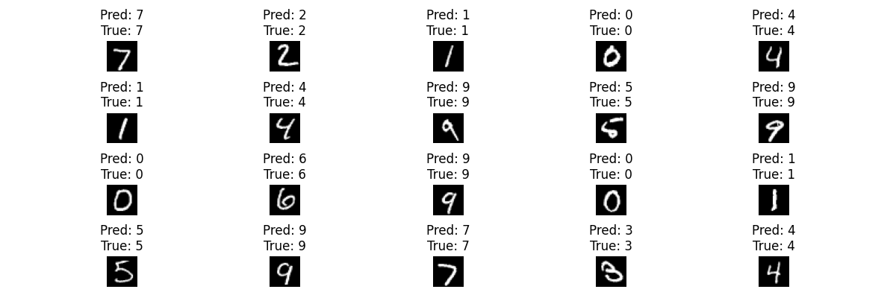

# MNIST Vision Transformer (from scratch) — PyTorch

A minimal Vision Transformer (ViT) implemented from scratch in PyTorch and trained on the MNIST dataset (10 classes).

## Project structure

- `models/vit.py` — ViT implementation (patch embedding + transformer encoder blocks + MLP head)
- `train_test_visualize.py` — training loop + validation accuracy (computed once at the end) + prediction visualization
- `config.py` — hyperparameters and model constants

## Setup

```bash
python -m venv .venv
source .venv/bin/activate
pip install -r requirements.txt
```

## Run
Train + validate + visualize
```bash
python3 train_test_visualize.py
```
What it does:
- Downloads MNIST to `./data/` (if not already present)
- Trains for `EPOCHS` epochs
- Computes validation accuracy once at the end using the `val_data` loader
- Visualizes a batch of images with predicted vs true labels

### Results
Training accuracy (example run):
- Epoch 1: 80.97%
- Epoch 2: 94.18%
- Epoch 3: 95.61%
- Epoch 4: 96.37%
- Epoch 5: 96.75%

Validation accuracy (computed once at the end): `96.72%`

### Visualization
Example batch predictions saved from `visualize()`:



## Notes
Current "val" dataset uses `train=False` MNIST split (commonly treated as the test set).
Later, we can split the 60k training set into train/val and keep train=False as a true test set.
